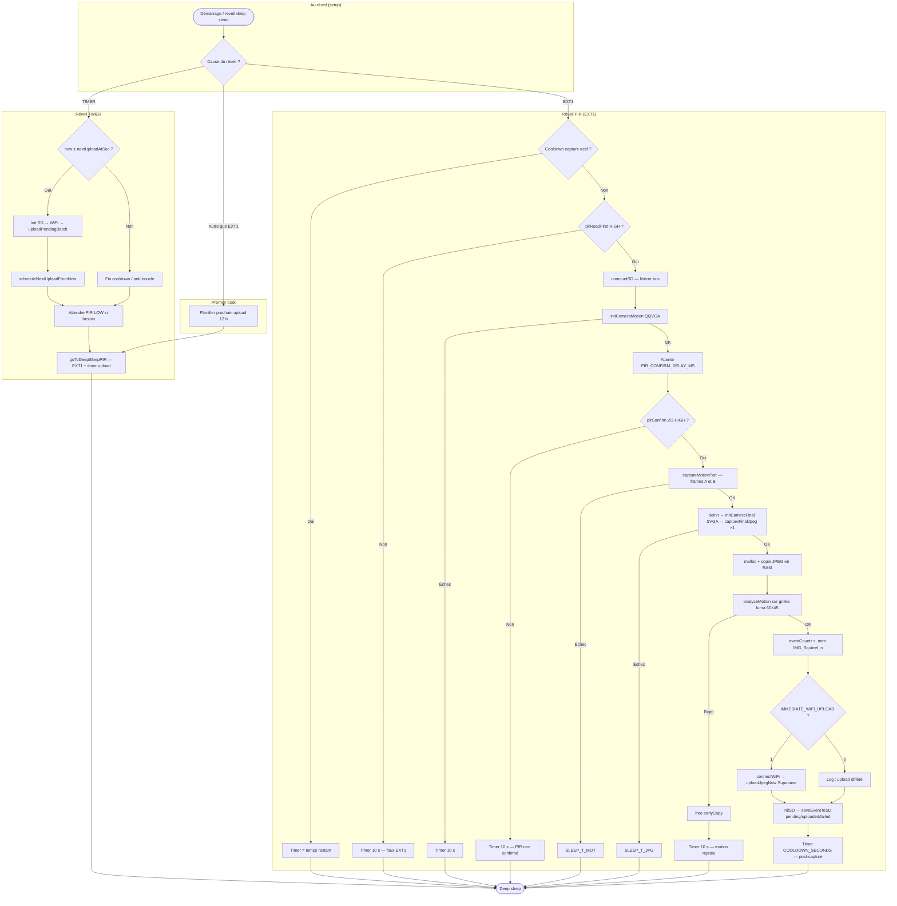
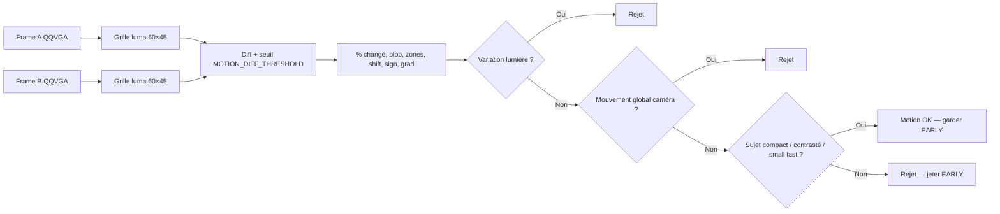

# Squirrel Detector v2 — Fonctionnement et choix techniques

**Projet :** Suivi environnement temps réel (M2 NEDD)  
**Matériel :** ESP32-S3 Freenove WROOM + caméra OV3660 + carte SD + capteur PIR (GPIO 2)  
**Firmware :** `SquirrelDetector_Sensors.ino` (Arduino ESP32 ≥ 2.0.14)

Ce document sert de support de présentation : il décrit le flux complet du firmware, justifie les choix par rapport au cahier des charges du projet, et liste chaque paramètre de la section **CONFIGURATION UTILISATEUR**.

---

## 1. Objectifs du projet (rappel)

D’après le plan d’implémentation IA du projet, le système doit :

| Exigence                             | Réponse dans le firmware                                                              |
|--------------------------------------|---------------------------------------------------------------------------------------|
|Réduire les faux positifs             |Double validation PIR + analyse motion sur deux mini-images QQVGA                      |
|Éviter réveils/transmissions inutiles |Rejet → deep sleep **timer** (PIR désarmé), pas de WiFi ni SD                          |
|Minimiser le WiFi                     |Upload différé par défaut (`IMMEDIATE_WIFI_UPLOAD = 0`) ; réveil timer toutes les 12 h |
|Une seule image finale de qualité     |JPEG SVGA unique (« EARLY »), les frames motion ne sont pas sauvegardées               |
|Stockage local + métadonnées          |SD : `/pending`, `/uploaded`, `/failed` + fichier `.json` par capture                  |
|Pas d’IA embarquée lourde             |Différence de luminance, blob, zones, filtres lumière — pas de TensorFlow / OpenCV     |

**Écart assumé pour les tests et la démo :** `IMMEDIATE_WIFI_UPLOAD = 1` envoie chaque image tout de suite (utile en développement, contraire au mode production 2×/jour).

---

## 2. Schéma du processus complet

Le diagramme ci-dessous couvre **toute la vie du firmware** : premier démarrage, veille, détection, capture, et upload par lots.

malloc: malloc (“memory allocation”) réserve dynamiquement un bloc de mémoire RAM à l’exécution et renvoie un pointeur vers ce bloc ; il faut ensuite le libérer avec free pour éviter les fuites mémoire.

Dans le code, malloc(earlyLen) sert à copier le JPEG EARLY dans une zone stable avant deinitCamera.

### 2.1 Ordre critique après validation PIR (v2.2)

Pour coller au moment où la motion « voit » le sujet (éviter de rater un passage rapide) :

1. **Paire motion** (A puis B) — QQVGA 160×120, exposition figée  
2. **EARLY SVGA** — une seule photo JPEG haute résolution (`FINAL_CAPTURE_BURST = 1`)  
3. **analyzeMotion** — filtre ; si rejet, l’EARLY est jetée (`free`) sans écriture SD

**Copie JPEG en RAM :** `malloc(earlyLen)` copie le buffer caméra **avant** `deinitCamera`

### 2.2 Deux modes de deep sleep

| Mode                 | Réveil                          | PIR         | Usage                                            |
|----------------------|---------------------------------|-------------|--------------------------------------------------|
| `goToDeepSleepPIR`   | EXT1* (PIR HIGH) + timer upload | Armé        | Veille normale, premier boot, fin fenêtre upload |
| `goToDeepSleepTimer` | Timer seul                      | **Désarmé** | Faux positif, cooldown, après capture            |

Après un rejet ou une capture, le timer évite une boucle de réveils EXT1 tant que le PIR reste HIGH.
*EXT1 est un mode de réveil deep sleep de l’ESP32 basé sur un masque de GPIO RTC (un ou plusieurs pins), avec une condition logique (ANY_HIGH ici).
Dans le code : si PIR_PIN passe à HIGH, l’ESP32 se réveille.

**EXT1** : mode de réveil deep sleep basé sur un masque de GPIO RTC ; ici `ESP_EXT1_WAKEUP_ANY_HIGH` sur `PIR_PIN`, si le PIR passe HIGH, l’ESP32 se réveille.

**PIR off/désarmé** : pendant `goToDeepSleepTimer`, seul le timer peut réveiller ; le PIR n’est pas source de wakeup.

### 2.3 Logs web (`http://squirrel-detector.local/`)

| Chemin                                             | WiFi connecté ?      | Fenêtre avant sleep                                   |
|----------------------------------------------------|----------------------|-------------------------------------------------------|
| Capture **acceptée** + `IMMEDIATE_WIFI_UPLOAD = 1` | Oui (`connectWiFi`)  | `goToDeepSleepTimer` → **15 s** (`WEB_LOG_WINDOW_MS`) |
| Rejet PIR / motion / erreur caméra                 | Non                  | Timer 10 s mais fenêtre **inactive** (pas de serveur) |
| Réveil **TIMER** (upload batch)                    | Oui pendant l’upload | Puis `goToDeepSleepPIR` → **0 s** (pas de fenêtre)    |
| Premier boot → veille PIR                          | Non                  | **0 s**                                               |

Le serveur démarre dans `connectWiFi()` ; `keepWebLogWindowOpen()` ne bloque que si WiFi connecté **et** serveur déjà démarré. En cas d’échec mDNS, utiliser l’**IP** affichée en série (`[OK] Logs web : http://x.x.x.x/`). Les logs sont aussi dupliqués dans un tampon RTC (`webLogBuffer`) via `BufferedSerial`.

---

## 3. Chaîne de validation (justification)

### 3.1 PIR — filtre grossier à basse consommation

Le PIR réveille l’ESP32 depuis le deep sleep (GPIO RTC). Seul un signal **persistant** déclenche la caméra :

- Lecture immédiate (`pirReadFirst`)
- Délai minimal `PIR_CONFIRM_DELAY_MS` après init caméra motion
- Puis **3 échantillons** ; au moins **2 HIGH** requis (`PIR_CONFIRM_MIN_HIGH`)

*Justification projet :* réduire parasites, vibrations du boîtier, impulsions ultra courtes (« double validation PIR »).

### 3.2 Motion — filtre « animal / main probable » sans IA

Deux images **160×120** (QQVGA) → grille **60×45** de luminance (patch 2×2 via `samplePatchLuma`) → comparaison cellule à cellule.

La luminance mesure la clarté perçue (conversion RGB565 → niveau de gris pondéré R/G/B). Le patch 2×2 lisse le bruit capteur entre les frames A et B.

Critères combinés :

- **Pourcentage de cellules changées** (ni trop faible, ni scène entière)
- **Plus grand blob** connecté (cluster) — rejette bruit et fond diffus
- **Zones actives** (grille macro 4×3) — rejette déplacement global de caméra
- **Filtre lumière** (`shift`, `sign`, `grad`) — rejette variation d’exposition uniforme
- **Voie sujet rapide** (`MOTION_SMALL_*`) — peu de % changé mais structure nette (contraste + gradient)
- **Acceptation sujet** — blob compact, contours locaux, ou gros cluster

Un **blob** est un groupe de cellules voisines marquées « changement ». Le firmware cherche le plus grand cluster connecté (BFS) : trop petit → bruit ; compact et assez grand → sujet plausible.

*Justification projet :* traitement ultra léger, pas d’IA embarquée, éviter sauvegarde/upload inutiles.

### 3.3 Image EARLY SVGA

- Résolution **SVGA** (`CAM_FINAL_SIZE`), JPEG qualité 10  
- **Une seule** capture (`FINAL_CAPTURE_BURST = 1`, `FINAL_BURST_GAP_MS = 0`) — pas de rafale ×3  
- `FINAL_CAMERA_WARMUP_MS = 0` (prise immédiate après `initCameraFinal`)  
- Copie en RAM **avant** `deinitCamera` (sinon on lit sur une mémoire vide)

*Justification projet :* une image finale pour classification espèce / état côté cloud ; les frames motion (QQVGA A/B) ne sont pas conservées.

### 3.4 Stockage et cloud

| Dossier SD  | Contenu                                                     |
|-------------|-------------------------------------------------------------|
| `/pending`  | En attente d’upload batch (mode production)                 |
| `/uploaded` | Envoyé avec succès Storage **et** ligne table `detection`   |
| `/failed`   | Échec WiFi ou Supabase (permet de ne pas perdre les images) |

Upload Supabase : bucket `photos-detection` + insertion JSON via `insertDetectionRow()` (`clip_labels: []`, `image_ia_path: null`). **Succès = Storage (200/201) + base (201)** ; sinon le fichier part en `/failed` (mode test immédiat) ou reste en `/pending`.

- **Bucket Supabase** : espace objet cloud où sont stockées les images (comme un répertoire de fichiers).
- **RTC (Real-Time Clock)** : mémoire persistante pendant deep sleep (`RTC_DATA_ATTR`) pour l’horloge relative, cooldown, compteurs et tampon de logs.

Horloge : **RTC logiciel** (`getNow()`), pas de NTP pour économiser la batterie. Upload batch : **toutes les 12 h** (2 envois / 24 h relatifs au démarrage).

### 3.5 Optimisations énergie

- CPU à **80 MHz** au boot  
- Bluetooth désactivé en veille (`powerOffRadios`)  
- WiFi uniquement fenêtre upload, mode test immédiat, ou connexion explicite  
- Logs web : fenêtre **15 s** avant `goToDeepSleepTimer` uniquement (si WiFi actif)

---

## 4. Analyse motion — vue simplifiée

### Détail du filtre lumière (anti faux positifs)

Le but est de rejeter les changements dus à la lumière (nuage, auto-exposition, ombre globale), sans rejeter un vrai sujet.

Le calcul se fait sur la grille 60×45, cellule par cellule entre frame A et frame B :
- `rawDiff = g2[i] - g1[i]` : variation signée de luminance  
- `d = abs(rawDiff)` : variation absolue  
- `changed` : cellules avec `d >= MOTION_DIFF_THRESHOLD`  
- `signPos` / `signNeg` : cellules montantes / descendantes (si `d >= MOTION_SIGN_MIN`)  
- `sameSignPct` : part du signe dominant (éclairage global)  
- `globalShift = abs(meanG2 - meanG1)` : décalage moyen de luminance  
- `avgLocalGrad` : gradient local moyen sur cellules changées (sujet = plus de contours)

Le rejet “lumière” est déclenché si les indices convergent vers une variation globale :
- beaucoup de cellules avec même signe (`sameSignPct` élevé),
- faible texture locale (`avgLocalGrad` faible),
- et/ou décalage global (`globalShift`) notable.

Pourquoi : la lumière modifie souvent toute l’image de façon homogène, alors qu’un animal/main génère un changement localisé, structuré et contrasté.
---

## 5. Paramètres — CONFIGURATION UTILISATEUR

Une phrase par paramètre, dans l’ordre du fichier source.

### 5.1 Réseau et Supabase

| Paramètre          | Rôle                                                      |
|--------------------|-----------------------------------------------------------|
| `WIFI_SSID`        | Nom du réseau WiFi utilisé pour l’upload et les logs web. |
| `WIFI_PASSWORD`    | Mot de passe du réseau WiFi.                              |
| `SUPABASE_URL`     | URL de base du projet Supabase (API REST).                |
| `SUPABASE_BUCKET`  | Nom du bucket Storage où sont déposées les photos.        |
| `SUPABASE_API_KEY` | Clé API (service role) pour Storage et insertion en base. |

### 5.2 Modes debug / production

| Paramètre               | Rôle                                                                                       |
|-------------------------|--------------------------------------------------------------------------------------------|
| `IMMEDIATE_WIFI_UPLOAD` | À `1`, upload Supabase après chaque capture ; à `0`, upload uniquement au                  |
                          | réveil timer (batch 12 h).                                                                 |
| `WEB_LOGS_ENABLED`      | Active le serveur HTTP de logs série pour debug sans câble USB.                            |
| `WEB_LOG_HOSTNAME`      | Nom mDNS du point d’accès / hôte pour accéder aux logs (`http://squirrel-detector.local`). |
| `WEB_LOG_PORT`          | Port TCP du serveur web de logs (80 par défaut).                                           |
| `WEB_LOG_WINDOW_MS`     | Durée d’attente avant deep sleep pour consulter les logs (0 = désactivé).                  |
| `WEB_LOG_BUFFER_SIZE`   | Taille du tampon RTC qui stocke les dernières lignes de log série.                         |

### 5.3 Entrées et temporisations générales

| Paramètre                  | Rôle                                                                                |
|----------------------------|-------------------------------------------------------------------------------------|
| `PIR_PIN`                  | Broche GPIO (RTC) du capteur PIR pour réveil EXT1.                                  |
| `COOLDOWN_SECONDS`         | Délai minimum entre deux captures réussies (veille timer, PIR off).                 |
| `FALSE_ALARM_COOLDOWN_SEC` | Délai de veille après un faux positif ou un rejet (anti-boucle EXT1).               |
| `PIR_CONFIRM_DELAY_MS`     | Temps minimum entre la première lecture PIR et la confirmation  multi-échantillons. |
| `PIR_LOW_POLL_MS`          | Cadence de vérification du retour à LOW.                                            |
| `WIFI_TIMEOUT_MS`          | Délai maximal pour établir la connexion WiFi.                                       |
| `MOTION_CAMERA_WARMUP_MS`  | Délai après init caméra mode motion avant les premières frames.                     |
| `FINAL_CAMERA_WARMUP_MS`   | Délai après init caméra mode JPEG SVGA avant la rafale.                             |
| `MOTION_FRAME_GAP_MS`      | Écart entre les deux mini-frames A et B pour détecter un déplacement  rapide.       |
| `MOTION_FLUSH_FRAMES`      | Nombre de frames jetées avant chaque capture motion (pipeline caméra  stable).      |
| `FINAL_CAPTURE_BURST`      | Nombre de JPEG SVGA pris à la suite ; la dernière est conservée.                    |
| `FINAL_BURST_GAP_MS`       | Pause entre chaque photo de la rafale finale (0 ms si burst = 1).                   |

### 5.4 Confirmation PIR

| Paramètre                 | Rôle                                                            |
|---------------------------|-----------------------------------------------------------------|
| `PIR_CONFIRM_SAMPLES`     | Nombre de lectures GPIO pour confirmer un mouvement persistant. |
| `PIR_CONFIRM_MIN_HIGH`    | Nombre minimal de lectures à HIGH pour valider le PIR.          |
| `PIR_CONFIRM_INTERVAL_MS` | Délai entre deux échantillons de confirmation PIR.              |

### 5.5 Grille et seuils motion

| Paramètre                       | Rôle                                                                                          |
|---------------------------------|-----------------------------------------------------------------------------------------------|
| `MOTION_GRID_W`                 | Largeur de la grille de luminance pour l’analyse (colonnes).                                  |
| `MOTION_GRID_H`                 | Hauteur de la grille de luminance (lignes).                                                   |
| `MOTION_DIFF_THRESHOLD`         | Écart de luma* minimal pour qu’une cellule soit considérée «changée».                         |
| `MOTION_SIGN_MIN`               | Seuil minimal de variation avant de compter le sens du changement (plus clair / plus sombre). |
| `MOTION_LIGHT_SAME_SIGN_PCT`    | Au-delà de ce %, les changements vont tous dans le même sens  (typique lumière).              |
| `MOTION_LIGHT_GLOBAL_SHIFT`     | Décalage moyen de luminance au-dessus duquel on suspecte l’exposition.                        |
| `MOTION_LIGHT_MAX_LOCAL_GRAD`   | Gradient local max typique d’un éclairage uniforme (peu de contours).                         |
| `MOTION_SUBJECT_MIN_LOCAL_GRAD` | Gradient local minimal pour accepter un vrai sujet (bords, texture).                          |
| `MOTION_MIN_CHANGED_PCT`        | Pourcentage minimal de cellules changées pour ne pas rejeter comme  « rien ».                 |
| `MOTION_MAX_CHANGED_PCT`        | Pourcentage maximal avant rejet « scène entière / trop de bruit ».                            |
| `MOTION_MIN_CLUSTER_CELLS`      | Taille minimale du plus grand blob de cellules changées.                                      |
| `MOTION_MIN_BLOB_W`             | Largeur minimale du rectangle englobant du blob.                                              |
| `MOTION_MIN_BLOB_H`             | Hauteur minimale du rectangle englobant du blob.                                              |
| `MOTION_MIN_CONCENTRATION_PCT`  | Part du changement concentrée dans le plus grand cluster (sujet moyen).                       |
| `MOTION_GLOBAL_ZONE_MIN`        | Nombre de zones actives suggérant un mouvement global (caméra secouée).                       |
| `MOTION_GLOBAL_CONC_MAX`        | Concentration max autorisée si presque toutes les zones bougent.                              |
| `MOTION_GLOBAL_CLUSTER_MAX`     | Seuil de cluster au-dessus duquel un gros sujet est accepté malgré beaucoup de zones.         |
| `MOTION_SUBJECT_MIN_CONC`       | Concentration minimale pour un sujet local compact.                                           |
| `MOTION_SUBJECT_MIN_CLUSTER`    | Taille de cluster minimale pour la voie « sujet local ».                                      |
| `MOTION_SUBJECT_MAX_ZONES`      | Nombre max de zones actives pour un sujet local (pas toute l’image).                          |
| `MOTION_SUBJECT_MIN_MAXDIFF`    | Pic de différence locale minimal (contraste fort).                                            |
| `MOTION_SUBJECT_MIN_AVGDIFF`    | Différence moyenne minimale sur la grille (mouvement net).                                    |
| `MOTION_UNIFORM_ZONE_MIN`       | Zones actives seuil pour rejeter un bruit de fond diffus.                                     |
| `MOTION_UNIFORM_CLUSTER_MAX`    | Cluster max pour ce rejet « fond diffus ».                                                    |
| `MOTION_UNIFORM_PCT_MAX`        | Pourcentage de changement max pour le rejet fond diffus.                                      |
| `MOTION_ZONE_COLS`              | Colonnes de la grille macro pour compter les zones actives.                                   |
| `MOTION_ZONE_ROWS`              | Lignes de la grille macro pour compter les zones actives.                                     |

*luma* = luminosité perçue (approximation niveau de gris depuis RGB565).

### 5.6 Caméra et SD

| Paramètre                         | Rôle                                                                    |
|-----------------------------------|-------------------------------------------------------------------------|
| `PWDN_GPIO_NUM`                   | Broche power-down caméra (−1 si non câblée).                            |
| `RESET_GPIO_NUM`                  | Broche reset caméra (−1 si non câblée).                                 |
| `XCLK_GPIO_NUM` … `PCLK_GPIO_NUM` | Cartographie des broches parallèles / SCCB de l’OV3660 (carte Freenove).|
| `CAM_MOTION_SIZE`                 | Résolution des frames d’analyse (`FRAMESIZE_QQVGA` = 160×120).          |
| `CAM_FINAL_SIZE`                  | Résolution de la photo sauvegardée (`FRAMESIZE_SVGA`).                  |
| `JPEG_FINAL_QUALITY`              | Qualité JPEG (plus bas = fichier plus petit, plus compressé).           |
| `SD_MMC_CLK` / `CMD` / `D0`       | Broches bus SD_MMC de la carte Freenove.                                |
| `SD_PENDING_DIR`                  | Chemin SD des images en attente d’upload.                               |
| `SD_UPLOADED_DIR`                 | Chemin SD des images déjà envoyées avec succès.                         |
| `SD_FAILED_DIR`                   | Chemin SD des images dont l’upload a échoué.                            |
| `UPLOAD_INTERVAL_HOURS`           | Intervalle entre deux réveils timer pour le batch WiFi (12 h = 2×/jour).|
| `SECONDS_PER_DAY`                 | Constante utilitaire pour calculs de durée (86400 s).                   |

---

## 6. Variables RTC (hors `#define`)

| Variable                     | Rôle                                                      |
|------------------------------|-----------------------------------------------------------|
| `bootCount`                  | Nombre de réveils depuis la mise sous tension.            |
| `rtcTimeBaseUs`              | Horloge logicielle persistante en microsecondes.          |
| `nextAllowedCaptureTime`     | Instant où une nouvelle capture est autorisée (cooldown). |
| `eventCount`                 | Compteur pour nommer les fichiers `IMG_Squirrel_{n}.jpg`. |
| `nextUploadAtSec`            | Prochain réveil timer dédié à l’upload batch.             |
| `dayStartSec`                | Ancrage « jour » relatif (réservé / legacy planning).     |
| `webLogBuffer` / `webLogLen` | Tampon des logs web en mémoire RTC.                       |

---

## 7. Messages série utiles pour une démo

| Log                                                                  | Signification                             |
|----------------------------------------------------------------------|-------------------------------------------|
| `[OK] Réveil par PIR détecté`                                        | EXT1 valide, début chaîne capture         |
| `[OK] PIR validé — capture paire motion, puis EARLY SVGA`            | PIR confirmé, enchaînement motion + photo |
| `[INFO] Motion frame A / B`                                          | Paire QQVGA capturée                      |
| `[OK] Image EARLY — … octets \| motion=… ms, JPEG après motion=… ms` | JPEG SVGA en RAM + métriques latence      |
| `[OK] Motion validée — on conserve l'image EARLY`                    | Filtre OK → SD / upload                   |
| `[INFO] Motion rejetée`                                              | EARLY jetée, timer 10 s                   |
| `[INFO] Réveil timer — fenêtre upload`                               | Batch Supabase depuis `/pending`          |
| `[OK] Logs web : http://squirrel-detector.local/`                    | Serveur mDNS actif                        |
| `[INFO] Logs web accessibles 15000 ms — avant deep sleep TIMER`      | Fenêtre navigateur ouverte                |

---

## 8. Pistes pour la slide « limites et suite »

- Classification espèce / santé : **côté cloud** (Supabase + pipeline IA), pas sur l’ESP32.  
- Réglage fin des seuils motion : terrain (main, écureuil, vent, nuages) ; grille 60×45 = plus de résolution, seuils blob/cluster à recaler ensemble.  
- Latence capture : compromis entre ordre motion → EARLY (précision) et vitesse (`PIR_CONFIRM_DELAY_MS`, `MOTION_FRAME_GAP_MS`, pas de rafale JPEG).  
- Production : `IMMEDIATE_WIFI_UPLOAD 0`, `WEB_LOG_WINDOW_MS 0`, WiFi seulement 2×/jour.  
- NTP non utilisé : horodatage relatif au boot, suffisant pour l’intervalle 12 h.

---
